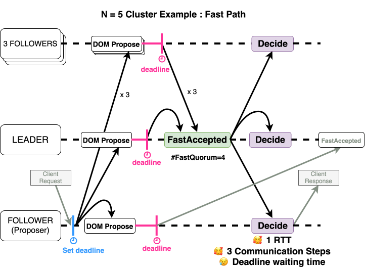
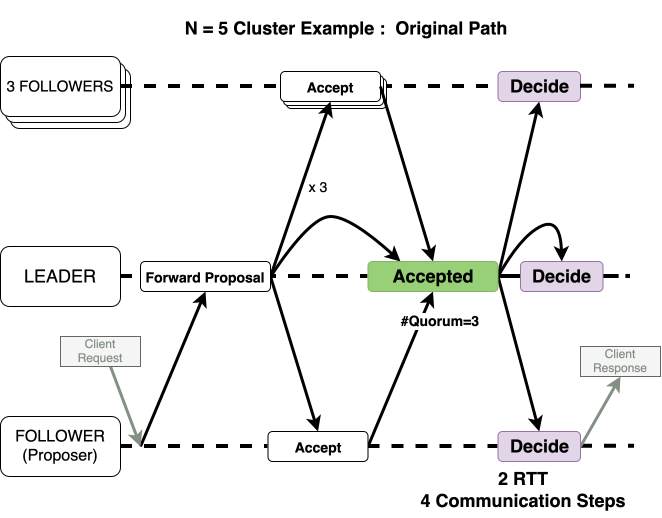

Clock Assisted OmniPaxos (CA-OP)
==============================

## Background

This project extends [OmniPaxos](https://github.com/haraldng/OmniPaxos), a Rust library for replicated log consensus.
The initial implementation was developed as part of the KTH course `ID2203: Distributed Systems, Advanced Course`, where we explored clock-assisted consensus.

CA-OP combines OmniPaxos with deadline-ordered message delivery inspired by the paper ["Nezha: Deployable and High-Performance Consensus Using Synchronized Clocks"](https://www.vldb.org/pvldb/vol16/p629-geng.pdf).

## My Contributions

- **CA-OP algorithm design**: designed the integration of OmniPaxos and deadline-ordered delivery
- **Implementation**: added the fast-path optimization that can decide in one RTT
- **Benchmarking**: built a reproducible benchmark harness to compare CA-OP against upstream OmniPaxos

## Algorithm Overview

The protocol introduces a fast path that reduces latency when proposals arrive before their deadline.

| | Fast Path | Original Path |
|---|---|---|
| **RTT** | **1** | 2 |
| **Communication Steps** | **3** | 4 |
| **Quorum** (`#Node = 2f+1`) | `f + floor(f/2) + 1` | `f + 1` |

### Fast Path



When a client request arrives and proposals reach followers before the deadline, followers respond with `FastAccepted`, allowing the leader to decide in one RTT.

### Slow Path



If the deadline is missed or the fast quorum is not reached, CA-OP falls back to the original OmniPaxos `Accept` / `Accepted` / `Decide` path.

## Benchmarking Results

The benchmark harness records:

- latency from client request and response timestamps
- throughput from completed responses per second
- fast-path ratio from leader-side decision statistics

Results are written under:

```text
benchmark/results/<experiment>/<protocol>/<scenario>/run-*/
```

Protocol values:

- `caop`
- `baseline`

Scenario examples:

- `local-high-rps10000`
- `small_jitter-medium-rps1000`
- `imbalance-low-rps5000`

The current repository contains the harness, runner scripts, and plotting tools. Generated benchmark data is not committed as the canonical result set.

## How To Run The Benchmarks

Detailed instructions are in [`benchmark/README.md`](./benchmark/README.md).

### Prerequisites

- Rust and Cargo
- Docker for containerized runs
- Containerlab for network-shaped experiments

### Local comparison

```bash
cd benchmark/settings
./run-benchmark.sh caop local medium 1000 1
./run-benchmark.sh baseline local medium 1000 1
```

### Containerlab comparison

```bash
cd benchmark/settings
./run-benchmark.sh caop small_jitter medium sweep 3
./run-benchmark.sh baseline small_jitter medium sweep 3
```

### Clock-quality sweep

```bash
cd benchmark/settings
./run-clock-benchmark.sh 3 caop
./run-clock-benchmark.sh 3 baseline
```

## Benchmarking Setup

The benchmark suite includes:

- a KV-store workload in [`benchmark/src`](./benchmark/src)
- a unified runner in [`benchmark/settings/run-benchmark.sh`](./benchmark/settings/run-benchmark.sh)
- local clock-quality sweeps in [`benchmark/settings/run-clock-benchmark.sh`](./benchmark/settings/run-clock-benchmark.sh)
- containerlab templates in [`benchmark/settings/clab`](./benchmark/settings/clab)
- protocol-comparison plots in [`benchmark/visualize/graph_clock_benchmark.py`](./benchmark/visualize/graph_clock_benchmark.py)

The upstream baseline used for comparison is vendored from:

- <https://github.com/haraldng/omnipaxos>

## Known Constraints

- The upstream baseline API differs from CA-OP. The benchmark uses a compatibility layer to run both protocols through the same client/server harness.
- `fast_path_ratio` is only meaningful for CA-OP. Baseline runs always report `0`.
- The containerlab templates shape per-node egress with `tc netem`, which is sufficient for scenario-level comparisons but not a full link-matrix emulator.
